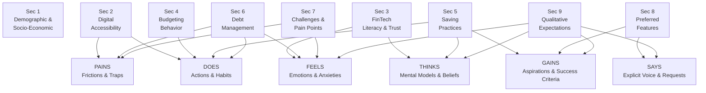

# Preliminary Survey — Section Outline & Empathy Map
## Public User Expectations and Perceptions Survey (PUEPS)

**Document:** `docs/assessment-evaluation/survey/preliminary-investigation/preliminary-survey-v2.md`
**Version:** 2 (Draft)
**Date:** 2026-09-19
**Based on:** `docs/assessment-evaluation/survey/preliminary-investigation/preliminary-survey-v1.md`
**Questionnaire:** `docs/assessment-evaluation/survey/preliminary-investigation/questionnaire-v1.md`

---

## Scope & Target Respondents

| Aspect | V1 | V2 |
|:-------|:---|:---|
| Target population | Filipino Workers aged 18–59 in NCR | **Filipinos aged 18–59 in NCR** (all employment/student statuses) |

**Design implication:** Income input is **not required** to participate. Non-income
earners (e.g., students, unemployed) remain eligible and may answer without
declaring a monthly income, so income statistics are derived only from
respondents who voluntarily provide them.

---

## Survey Sections & Objectives

1. ### Demographic & Socio-Economic Profile
   **Objective:** To identify respondents' socio-economic status, employment classification, income stability, age, and other demographic factors relevant to contextualize daily financial needs.

2. ### Digital Accessibility & Connectivity
   **Objective:** To assess respondents' smartphone specifications and network connectivity constraints to evaluate mobile accessibility and offline synchronization requirements.

3. ### Digital Financial Technology Literacy & Trust
   **Objective:** To evaluate respondents' familiarity, confidence, security concerns, and adoption readiness regarding digital financial management tools and automated algorithms.

4. ### Day-to-Day Financial Management & Budgeting Behavior
   **Objective:** To analyze respondents' current income allocation processes, expense tracking routines, and budget adjustment practices during everyday financial management.

5. ### Saving Practices & Goal Management
   **Objective:** To examine respondents' savings methods, emergency fund preparedness, goal-setting consistency, and the socio-economic factors (such as family support) that affect savings growth.

6. ### Debt Management & Repayment Practices
   **Objective:** To assess respondents' debt composition (credit cards, loans, BNPL, informal debt), repayment prioritization methods (e.g., Snowball vs. Avalanche), and recurring obstacles to debt reduction.

7. ### Financial Management Challenges & Pain Points
   **Objective:** To identify the friction points, cognitive fatigue, emotional stress, and tool limitations respondents experience when managing budgets, maintaining savings, and paying off debt.

8. ### Preferred Features for Buddi
   **Objective:** To measure user demand and prioritization for proposed system capabilities, including budget optimization, spending forecasts, anomaly alerts, and structured debt payoff tracking.

9. ### Qualitative Expectations & Definitions of Financial Success
   **Objective:** To capture open-ended insights into respondents' emotional relationship with money, expectations from an intelligent financial assistant, and personal definitions of financial freedom.

---

## Empathy Map — Section Alignment

---

## Empathy Map — Dimension Breakdown

### DOES — Observable Actions & Habits
*What the user regularly does when managing their finances.*

| Section | Coverage |
|:--------|:---------|
| **Sec 2 — Digital Accessibility & Connectivity** | Device usage patterns, mobile data habits, offline behavior |
| **Sec 4 — Budgeting Behavior** | Expense logging routines, income allocation at payday, use of manual tools (spreadsheet, notebook) |
| **Sec 5 — Saving Practices** | Frequency of setting aside savings, managing personal vs. household money |
| **Sec 6 — Debt Management** | Loan and credit card payment routines, minimum vs. full payment behavior |

---

### THINKS — Mental Models & Beliefs
*What the user thinks and believes about money and financial tools.*

| Section | Coverage |
|:--------|:---------|
| **Sec 3 — FinTech Literacy & Trust** | Attitudes toward automated financial tools and algorithmic recommendations |
| **Sec 5 — Saving Practices** | Beliefs about financial security, emergency preparedness, and family support obligations |
| **Sec 9 — Qualitative Expectations** | Personal definitions of financial wellness and freedom |

---

### FEELS — Emotions & Anxieties
*What the user feels when confronted with their financial situation.*

| Section | Coverage |
|:--------|:---------|
| **Sec 3 — FinTech Literacy & Trust** | Overwhelm or hesitation when using complex finance apps; data privacy fears |
| **Sec 6 — Debt Management** | Debt anxiety, stress over multiple due dates, fear of compounding interest |
| **Sec 7 — Challenges & Pain Points** | Guilt over impulsive spending, fatigue from manual tracking, shame around budget deficits |
| **Sec 9 — Qualitative Expectations** | Emotional relationship with money; anxieties about financial future |

---

### SAYS — Explicit Voice & Feature Requests
*What the user explicitly expresses they need or want.*

| Section | Coverage |
|:--------|:---------|
| **Sec 8 — Preferred Features for Buddi** | Prioritized feature demands: budget optimization, spending forecasts, anomaly alerts, debt payoff planner |
| **Sec 9 — Qualitative Expectations** | Open-ended user voice on what an ideal financial assistant must deliver |

---

### PAINS — Frictions, Obstacles & Traps
*The recurring problems and frustrations the user encounters.*

| Section | Coverage |
|:--------|:---------|
| **Sec 2 — Digital Accessibility & Connectivity** | Poor data connectivity, offline limitations blocking app use |
| **Sec 6 — Debt Management** | Multiple overlapping due dates, high interest rates, lack of a clear payoff order |
| **Sec 7 — Challenges & Pain Points** | Budget breakdowns, forgotten manual entries, tools misaligned with Filipino financial realities |

---

### GAINS — Aspirations & Success Criteria
*What the user hopes to achieve and how they measure financial success.*

| Section | Coverage |
|:--------|:---------|
| **Sec 5 — Saving Practices** | Consistent emergency cushion, milestone savings, stable financial safety net |
| **Sec 8 — Preferred Features for Buddi** | Automated budget distribution, proactive overspending alerts, optimized debt repayment timeline |
| **Sec 9 — Qualitative Expectations** | Peace of mind, debt-free living, sustained financial independence |