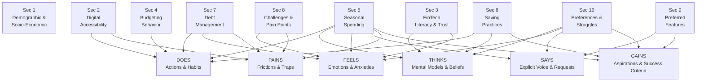

# Preliminary Survey — Section Outline & Empathy Map
## Public User Expectations and Perceptions Survey (PUEPS)

**Document:** `docs/assessment-evaluation/survey/preliminary-investigation/preliminary-survey-v3.md`
**Version:** 3 (Draft)
**Date:** 2026-09-24
**Based on:** `docs/assessment-evaluation/survey/preliminary-investigation/preliminary-survey-v2.md`
**Questionnaire:** `docs/assessment-evaluation/survey/preliminary-investigation/questionnaire-v3.md` (see Revision Notes)

---

## Revision Notes (V2 → V3)

| Change | Detail |
|:-------|:-------|
| **New section added** | **Sec 5 — Seasonal & Occasion-Based Spending Patterns** inserted after Day-to-Day Budgeting Behavior to capture how Filipinos' spending rises and falls across Philippine seasons and recurring occasions (Christmas/New Year, summer and hot months, back-to-school, fiestas, Undas, rainy season). |
| **Sections renumbered** | Former Sec 5–9 (Saving Practices, Debt Management, Challenges, Preferred Features, Qualitative Expectations) shifted to Sec 6–10. |
| **Empathy map updated** | The new Sec 5 is mapped into the section-alignment diagram and into **all six** empathy-map dimensions (DOES, THINKS, FEELS, SAYS, PAINS, GAINS). |
| **Questionnaire v3 created** | `questionnaire-v3.md` (2026-09-24) adds the Section 5 seasonal items, adopts the V3 section numbering, and refocuses Section 10 on feature preferences and money struggles. |

---

## Scope & Target Respondents

| Aspect | V2 | V3 |
|:-------|:---|:---|
| Target population | Filipinos aged 18–59 in NCR (all employment/student statuses) | **Unchanged** — Filipinos aged 18–59 in NCR (all employment/student statuses) |
| Seasonal spending | Not covered | **New — Section 5** measures spending variation across Philippine seasons and occasions |

**Design implication:** Income input is **not required** to participate. Non-income
earners (e.g., students, unemployed) remain eligible and may answer without
declaring a monthly income, so income statistics are derived only from
respondents who voluntarily provide them.

**Design implication (V3):** Seasonal spending is captured through recall items —
respondents indicate whether their spending *increases*, *decreases*, or *stays
the same* during specific periods (e.g., Christmas and New Year, summer/hot
months) and how they cope with those spikes. No transaction records are
required, keeping the instrument lightweight while still producing direct
evidence of spending seasonality for BUDGIE's time-aware forecasting (SARIMA) and
anomaly-detection (IQR) modules.

---

## Survey Sections & Objectives

1. ### Demographic & Socio-Economic Profile
   **Objective:** To identify respondents' socio-economic status, employment classification, income stability, age, and other demographic factors relevant to contextualize daily financial needs.

2. ### Digital Accessibility & Connectivity
   **Objective:** To assess respondents' smartphone specifications and network connectivity constraints to evaluate mobile accessibility and offline synchronization requirements.

3. ### Digital Financial Technology Literacy & Trust
   **Objective:** To evaluate respondents' familiarity, confidence, security concerns, and adoption readiness regarding digital financial management tools and automated algorithms.

4. ### Day-to-Day Financial Management & Budgeting Behavior
   **Objective:** To analyze respondents' current income allocation processes, expense tracking routines, and budget adjustment practices during everyday financial management.

5. ### Seasonal & Occasion-Based Spending Patterns
   **Objective:** To identify how respondents' spending rises and falls across Philippine seasons and recurring occasions — including the Christmas and New Year holidays (`ber` months), summer and hot months, the back-to-school season, town fiestas, All Saints' Day (Undas), and the rainy season — and to determine how respondents anticipate, absorb, and recover from these periodic cost spikes, providing direct evidence for season-aware budgeting and time-based spending forecasts.

6. ### Saving Practices & Goal Management
   **Objective:** To examine respondents' savings methods, emergency fund preparedness, goal-setting consistency, and the socio-economic factors (such as family support) that affect savings growth.

7. ### Debt Management & Repayment Practices
   **Objective:** To assess respondents' debt composition (credit cards, loans, BNPL, informal debt), repayment prioritization methods (e.g., Snowball vs. Avalanche), and recurring obstacles to debt reduction.

8. ### Financial Management Challenges & Pain Points
   **Objective:** To identify the friction points, cognitive fatigue, emotional stress, and tool limitations respondents experience when managing budgets, maintaining savings, and paying off debt.

9. ### Preferred Features for Buddi
   **Objective:** To measure user demand and prioritization for proposed system capabilities, including budget optimization, spending forecasts, anomaly alerts, and structured debt payoff tracking.

10. ### Qualitative Feature Preferences & Financial Struggles
    **Objective:** To capture which proposed Buddi feature respondents value the most and why, and to hear, in their own words, their biggest struggle in managing their personal finances.

---

## Empathy Map — Section Alignment

---

## Empathy Map — Dimension Breakdown

### DOES — Observable Actions & Habits
*What the user regularly does when managing their finances.*

| Section | Coverage |
|:--------|:---------|
| **Sec 2 — Digital Accessibility & Connectivity** | Device usage patterns, mobile data habits, offline behavior |
| **Sec 4 — Budgeting Behavior** | Expense logging routines, income allocation at payday, use of manual tools (spreadsheet, notebook) |
| **Sec 5 — Seasonal & Occasion-Based Spending** | Spending surges during Christmas/New Year (gifts, *noche buena*, *media noche*, *aguinaldo*), summer and hot months (electricity, travel, hydration), back-to-school (tuition, uniforms, supplies), town fiestas, Undas, and the rainy season; post-holiday belt-tightening ("January pinch") and seasonal recovery habits |
| **Sec 6 — Saving Practices** | Frequency of setting aside savings, managing personal vs. household money |
| **Sec 7 — Debt Management** | Loan and credit card payment routines, minimum vs. full payment behavior |

---

### THINKS — Mental Models & Beliefs
*What the user thinks and believes about money and financial tools.*

| Section | Coverage |
|:--------|:---------|
| **Sec 3 — FinTech Literacy & Trust** | Attitudes toward automated financial tools and algorithmic recommendations |
| **Sec 5 — Seasonal & Occasion-Based Spending** | Beliefs that holiday and festive spending is obligatory (gift-giving, family expectations); mental models that "ber months are expensive"; the belief that preparing and saving in advance makes peak seasons manageable |
| **Sec 6 — Saving Practices** | Beliefs about financial security, emergency preparedness, and family support obligations |
| **Sec 10 — Feature Preferences & Struggles** | Which features people value most and why; how they understand their own money struggles |

---

### FEELS — Emotions & Anxieties
*What the user feels when confronted with their financial situation.*

| Section | Coverage |
|:--------|:---------|
| **Sec 3 — FinTech Literacy & Trust** | Overwhelm or hesitation when using complex finance apps; data privacy fears |
| **Sec 5 — Seasonal & Occasion-Based Spending** | Stress and anxiety over December expenses; fear of not having enough for gifts and celebrations; guilt or regret after festive overspending; dread of the January budget crunch; shock from summer electricity bills |
| **Sec 7 — Debt Management** | Debt anxiety, stress over multiple due dates, fear of compounding interest |
| **Sec 8 — Challenges & Pain Points** | Guilt over impulsive spending, fatigue from manual tracking, shame around budget deficits |
| **Sec 10 — Feature Preferences & Struggles** | Feelings and frustrations tied to their biggest money struggle |

---

### SAYS — Explicit Voice & Feature Requests
*What the user explicitly expresses they need or want.*

| Section | Coverage |
|:--------|:---------|
| **Sec 5 — Seasonal & Occasion-Based Spending** | Explicit admissions such as "I always overshoot my budget during Christmas"; requests for pre-holiday budgeting help, occasion-aware spending forecasts, and warnings before known expensive seasons |
| **Sec 9 — Preferred Features for Buddi** | Prioritized feature demands: budget optimization, spending forecasts, anomaly alerts, debt payoff planner |
| **Sec 10 — Feature Preferences & Struggles** | Open-ended voice on which features they like and why; descriptions of their biggest money struggles |

---

### PAINS — Frictions, Obstacles & Traps
*The recurring problems and frustrations the user encounters.*

| Section | Coverage |
|:--------|:---------|
| **Sec 2 — Digital Accessibility & Connectivity** | Poor data connectivity, offline limitations blocking app use |
| **Sec 5 — Seasonal & Occasion-Based Spending** | Budgets breaking every December; 13th-month pay absorbed by holiday spending; borrowing or dipping into savings to fund celebrations; unbudgeted tuition, electricity, and travel spikes in summer and back-to-school season |
| **Sec 7 — Debt Management** | Multiple overlapping due dates, high interest rates, lack of a clear payoff order |
| **Sec 8 — Challenges & Pain Points** | Budget breakdowns, forgotten manual entries, tools misaligned with Filipino financial realities |

---

### GAINS — Aspirations & Success Criteria
*What the user hopes to achieve and how they measure financial success.*

| Section | Coverage |
|:--------|:---------|
| **Sec 5 — Seasonal & Occasion-Based Spending** | Setting aside holiday funds in advance; celebrating seasons and families without going into debt; keeping savings intact even during "ber" months and summer; smooth cash flow through peak-spending periods |
| **Sec 6 — Saving Practices** | Consistent emergency cushion, milestone savings, stable financial safety net |
| **Sec 9 — Preferred Features for Buddi** | Automated budget distribution, proactive overspending alerts, optimized debt repayment timeline |
| **Sec 10 — Feature Preferences & Struggles** | What people hope their preferred feature will fix; the struggles they want the app to solve |