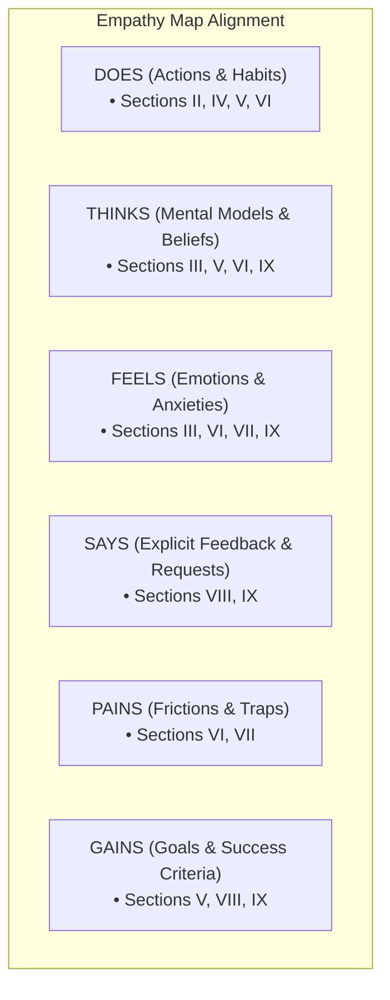

# Preliminary Survey Objectives & Empathy Map Analysis

**Document:** `docs/assessment-evaluation/survey/preliminary-investigation/preliminary-survey-v1.md`  
**Reference Document:** `docs/requirements-engineering/feature-modules-v2.md`  
**Application Focus:** BUDGIE — Budgeting, Building Savings, and Reducing Debt  

---

## 1. Redundancy & Consistency Analysis

### Identified Overlaps & Structural Issues

| Section Pair / Focus                                                                       | Identified Redundancy / Conflict                                                                                                                                                                                                                                                                                                                                                                        | Recommended Resolution                                                                                                                                                                                                                                                                                                                                                             |
| :----------------------------------------------------------------------------------------- | :------------------------------------------------------------------------------------------------------------------------------------------------------------------------------------------------------------------------------------------------------------------------------------------------------------------------------------------------------------------------------------------------------ | :--------------------------------------------------------------------------------------------------------------------------------------------------------------------------------------------------------------------------------------------------------------------------------------------------------------------------------------------------------------------------------- |
| **Section IV vs. Section V**<br>*(Financial Management Behavior vs. Saving Practices)*     | **High Redundancy:** Section V’s objective currently includes *"budgeting habits"* and *"expense management behavior"*, which directly duplicates Section IV’s focus on budgeting workflows and expense monitoring.<br><br>*Note on Target Group:* Section V explicitly restricts the audience to *"Filipino young professionals"*, whereas all other sections use general *"respondents"* terminology. | **Refocus Section V Exclusively on Savings:**<br>Remove *"budgeting habits"* and *"expense management"* from Section V. Shift its objective entirely to savings vehicles, emergency fund adequacy, target milestones, consistency, and socio-economic triggers (e.g., family remittances, dependents).                                                                             |
| **Section VII vs. Sections IV, V, & VI**<br>*(Budgeting Challenges vs. Core Practices)*    | **Narrow Scope vs. Multi-Pillar Pain Points:** Section VII focuses only on *Budgeting Challenges*. However, pain points related to **Savings** (unplanned withdrawals, "petsa de peligro") and **Debt** (compounding interest, juggling multiple due dates, minimum payment traps) are scattered or omitted.                                                                                            | **Broaden Section VII to All Three Pillars:**<br>Rename Section VII to **"Financial Management Challenges & Pain Points"** to explicitly capture friction across budgeting, saving, and debt payoff.                                                                                                                                                                               |
| **Section VIII vs. Section IX**<br>*(Preferred Features vs. Proposed System Expectations)* | **Overlap in Expectations:** Section VIII covers *"usability expectations"* while Section IX captures *"underlying expectations, concerns, and personal definitions of success"*.                                                                                                                                                                                                                       | **Delineate Quantitative vs. Qualitative:**<br>• **Section VIII:** Quantitative prioritization of concrete features (LP budget optimizer, SARIMA forecasting, IQR anomaly alerts, Snowball/Avalanche strategies, offline sync).<br>• **Section IX:** Open-ended qualitative sentiments, emotional anxieties, data privacy/trust hesitations, and definitions of financial freedom. |
| **Naming & Formatting Consistency**                                                        | Section VIII uses *"Buddi"* (project standard is *BUDGIE* / *ODIN*) and plural *"Objectives:"* while other sections use singular *"Objective:"*.                                                                                                                                                                                                                                                          | Standardize product naming to **BUDGIE** and use consistent header/objective syntax.                                                                                                                                                                                                                                                                                                 |

---

## 2. Empathy Map Viability

The preliminary survey sections cover all six dimensions of a standard **Empathy Map** (**Says, Thinks, Does, Feels, Pains, Gains**), tailored specifically to an application centered on **Budgeting, Building Savings, and Reducing Debt**.



### Breakdown by Empathy Map Dimension

1. **DOES (Observable Actions & Habits):**
   - **Section II:** Digital access, device usage, mobile data constraints, online/offline habits.
   - **Section IV:** Expense logging routines, payday allocation workflows, manual spreadsheet/notebook use.
   - **Section V:** Setting aside savings, deposit frequency, managing personal vs. household money.
   - **Section VI:** Bill and debt payment routines (paying minimum vs. full, loan tracking).

2. **THINKS (Beliefs, Values, & Mental Models):**
   - **Section III:** Attitude toward FinTech automation and trust in digital algorithms.
   - **Section V:** Perceptions of financial security, emergency preparedness, and family support norms.
   - **Section IX:** Mental definitions of financial wellness and freedom.

3. **FEELS (Emotional States & Anxieties):**
   - **Section III:** Intimidation or hesitation when using complex financial apps.
   - **Section VI:** Debt stress, anxiety over due dates, fear of penalties/interest accrual.
   - **Section VII & IX:** Guilt over impulsive spending, overwhelm from tedious manual tracking, shame around budget deficits.

4. **SAYS (Explicit Voice & Feature Demands):**
   - **Section VIII:** Preferred tool capabilities, interface needs, and functional wishlists.
   - **Section IX:** Open-ended user quotes on what an ideal financial companion must deliver.

5. **PAINS (Frustrations, Obstacles, & Traps):**
   - **Section VI:** Multiple loan schedules, high interest rates, lack of clear payoff order.
   - **Section VII:** Budget breakage, forgotten manual entries, rigid budgeting tools, unexpected expenses.

6. **GAINS (Aspirations & Measures of Success):**
   - **Section V:** Consistent emergency cushion and milestone savings.
   - **Section VIII:** Automated budget distribution, proactive overspending alerts, optimized debt timelines.
   - **Section IX:** Peace of mind, debt-free living, and sustained financial independence.

---

## 3. Feature Mapping with `feature-modules-v2.md`

The survey structure directly informs and validates the functional modules specified in `feature-modules-v2.md`:

| Core App Pillar                       | Corresponding Feature Modules (`feature-modules-v2.md`)                                                                                                                                                                                                                                                                                                 | Mapped Survey Sections   | Target User Insights Derived                                                                                                                                                                                                      |
| :------------------------------------ | :------------------------------------------------------------------------------------------------------------------------------------------------------------------------------------------------------------------------------------------------------------------------------------------------------------------------------------------------------ | :----------------------- | :-------------------------------------------------------------------------------------------------------------------------------------------------------------------------------------------------------------------------------- |
| **1. Budgeting**                      | • **Module 5:** Income Sources (Stable/Variable, Frequencies)<br>• **Module 6:** Budgeting & LP Optimizer (Envelopes, Deficit/Surplus Handling)<br>• **Module 10:** Categories & Restrictions (Protected spending)<br>• **Module 12:** Transaction Management (Recurrences, Logging)<br>• **Module 14:** Forecasting & Anomaly Detection (SARIMA / IQR) | **Sec IV, VII, VIII**    | • Handling irregular or semi-monthly income schedules.<br>• Willingness to adopt mathematical budget allocations (LP Optimizer).<br>• Need for real-time anomaly alerts and predictive spending trends.                           |
| **2. Building Savings**               | • **Module 8:** Savings Goals (Target amounts, target dates, Savings Envelopes, priority tiers, lock-in)<br>• **Module 6.5:** Savings Envelope allocation in active budget                                                                                                                                                                              | **Sec V, VIII, IX**      | • Types of goals prioritized (Emergency fund, education, major purchases).<br>• Behavioral triggers for dipping into savings (family support / medical).<br>• Preferences for flexible vs. locked goal allocations.               |
| **3. Reducing Debt**                  | • **Module 7:** Debt Management (Global Snowball vs. Avalanche strategies)<br>• **Module 7.2:** Credit Card Module (Billing cycles, cutoffs, minimum vs. full pay)<br>• **Module 11:** Financial Obligations                                                                                                                                            | **Sec VI, VII, VIII**    | • Mix of debt instruments (Credit cards, BNPL, SSS/Pag-IBIG, informal loans).<br>• Psychological preference between Snowball (quick wins) and Avalanche (interest savings).<br>• Credit card billing cycle tracking difficulties. |
| **4. Architectural & UX Foundations** | • **Module 2:** Onboarding Questionnaire & SVM Profile Classification<br>• **Module 13:** Alerts & Notifications<br>• **Module 16:** Offline Sync & Recovery                                                                                                                                                                                            | **Sec I, II, III, VIII** | • Validation of offline-first requirements (data/connectivity limits).<br>• Baseline FinTech literacy for onboarding UX design.<br>• Demographic features feeding into SVM financial profile classification.                      |

---

## 4. Suggested Revised Section Objectives

Below is the optimized objective set for `preliminary-survey-v1.md` that eliminates redundancies and aligns with both the Empathy Map and `feature-modules-v2.md`:

```markdown
# I. Demographic & Socio-Economic Profile
Objective: To identify respondents' socio-economic status, employment classification, income stability, age, and family dependency burden to support user segmentation, persona modeling, and profile classification.

# II. Digital Accessibility & Connectivity
Objective: To assess respondents' device hardware, mobile data reliance, and network connectivity constraints to validate mobile usability and offline synchronization requirements.

# III. Digital Financial Technology Literacy & Trust
Objective: To evaluate respondents' familiarity, confidence, security concerns, and adoption readiness regarding digital financial management tools and automated algorithms.

# IV. Day-to-Day Financial Management & Budgeting Behavior
Objective: To analyze respondents' current income allocation processes, expense tracking routines, and budget adjustment practices during everyday financial management.

# V. Saving Practices & Goal Management
Objective: To examine respondents' savings vehicles, emergency fund preparedness, goal-setting consistency, and the socio-economic factors (such as family support) that affect savings growth.

# VI. Debt Management & Repayment Practices
Objective: To assess respondents' debt composition (credit cards, loans, BNPL, informal debt), repayment prioritization methods (e.g., Snowball vs. Avalanche), and recurring obstacles to debt reduction.

# VII. Financial Management Challenges & Pain Points
Objective: To identify the friction points, cognitive fatigue, emotional stress, and tool limitations respondents experience when managing budgets, maintaining savings, and paying off debt.

# VIII. Preferred Features for BUDGIE
Objective: To measure user demand and prioritization for proposed system capabilities, including LP-based budget optimization, SARIMA spending forecasts, IQR anomaly alerts, and structured debt payoff tracking.

# IX. Qualitative Expectations & Definitions of Financial Success
Objective: To capture open-ended insights into respondents' emotional relationship with money, expectations from an intelligent financial assistant, and personal definitions of financial freedom.
```
